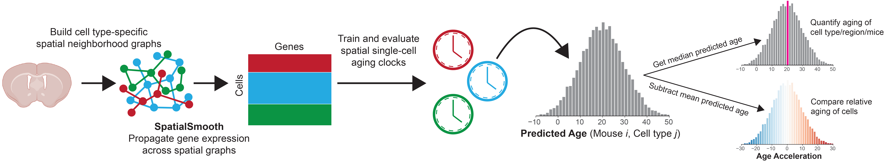
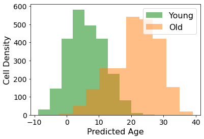
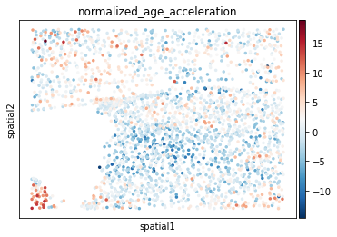

# Spatial Aging Clocks

This Python software package provides tools for deploying our spatial aging clocks (trained on brain coronal sections across 20 ages) to a single-cell dataset (both spatial or non-spatial).




## Installation and setup

Complete installation (including of dependencies) in a new Conda environment should take less than 5 minutes on a normal desktop/laptop setup (Windows, Mac OSX, Linux). The base version only requires SquidPy and all of its dependencies.

Currently, the package is available through local installation (but will also become installable through pip)

### Install with `pip`

Install the package through PyPI with `pip`. We recommend setting up a conda environment (https://docs.conda.io/projects/conda/en/latest/user-guide/tasks/manage-environments.html) or another virtual environment first since `spatial-aging-clock` currently relies on specific versions for its dependencies (although it should generally work for other environment versions, but this hasn't been thoroughly tested):

```
conda create -n myenv python=3.8
conda activate myenv

<pip install any additional dependencies>
pip install spatial-aging-clock
```

Note that you will want to separately download the data from this repository (`tests/data/`) to run our tutorials.


### Install locally

An alternative way to install the package along with associated test and tutorial files is to clone the directory and then install the requirements for using the package. To do this, first clone the repository using git (you can install git following the instructions [here](https://github.com/git-guides/install-git)):

```
git clone https://github.com/sunericd/SpatialAgingClock.git
```

We recommend setting up a conda environment to install the requirements for the package (instructions for installing conda and what conda environment can do can be found [here](https://docs.conda.io/projects/conda/en/latest/user-guide/install/index.html)). Installation of requirements can then be done with the following commands:

```
conda create -n SpatialClock python=3.8
conda activate SpatialClock

cd SpatialAgingClock
pip install -r requirements.txt
```

To test that the installation is working correctly, you can run `python test.py` in the cloned directory.


# Documentation

Below we include documentation and several mini-tutorials to highlight the main utilities of this package for deploying our spatial aging clocks.

## Modules and functions

### Deploy spatial aging clocks

`spatialclock.deploy` - module for deploying spatial aging clocks


- `get_predictions` - generates predicted ages with spatial aging clocks
    - Inputs:
        - `adata` [AnnData] - data for which to obtain predictions for
        - `clock_obj_name` [str] - str identifier for the directory containing cell type-specific pkl model files adn training adata
        - `fill_missing` [str] - how to impute missing gene values for prediction
            - "mean" --> impute with mean value
            - "spage" --> uses SpaGE algorithm to impute missing values from training data
        - `smooth` [bool] - whether to smooth ; change to False if no adata.obsm["spatial"] in adata
        - `pseudobulk_data` [bool] - if smooth is False, whether to pseudobulk data instead
        - `normalize` [bool] - whether to normalize data using utils.normalize_adata
        - `standardize` [bool] - whether to standardize data using the pipeline in the pkl files
        - `add_in_place` [bool] - whether to add predictions to adata.obs["predicted_age"] inplace
    
    - Outputs:
        - [DataFrame] - columns with cell type, pred_age, cohort, and age


- `get_age_acceleration` - computes age acceleration for predicted ages
    - Inputs: `adata` [AnnData] - must have adata.obs.predicted_age
    - Outputs: Adds 'normalized_age_acceleration' to adata.obs

### Cell proximity effects

`spatialclock.proximity` - module for performing cell proximity effect analysis


- `nearest_distance_to_celltype` - computes near/far cell proximity sets
    - Inputs:
        - `adata` [AnnData] - anndata containing the spatial transcriptomics and has adata.obs['celltype'] and adata.obsm['spatial']
        - `celltype_list` [list of str] - celltype string identifiers found in adata.obs['celltype']
        - `sub_id` [str or None] - name of adata.obs column to use to subset before identifying distances
    - Output: Saves cell proximity sets into `adata`


- `compute_proximity_effects` - computes proximity effect and other statistics
    - Inputs:
        - `cutoff` [int or dict]
            - if int, then use this cutoff distance for all examples
            - if dict, then use {cutoff[region] = int} distance 
        - `celltypes` [lst] - list of strings specifying effector cell types to compute proximity effects for
        - `cutoff_multiplier` [float] - multipler for radius cutoff
        - `ring_width` [None or float] - width of ring to sample near cells where outer distance is cutoff*cutoff_multipler; if None, then sample all cells within cutoff (i.e. circle)
        - `region_obs` [str] - key in adata.obs to get region labels
        - `celltype_obs` [str] - key in adata.obs to get cell type labels
        - `animal_obs` [str] - key in adata.obs to get animal/sample labels
        - `comparison` [str] - how to determine "far" comparison group ("farthest", "random", "transcript_count")
        - `min_pairs` [int] - minimum number of cells in near/far set to compute proximity effect for

 - Output:
    - [Dataframe] - containing the following columns:
         - "Near Cell", effector cell type name
         - "AgeAccel Cell", target cell type name
         - "n", cutoff multiplier used
         - "t", t-test statistic
         - "p", p-value from t-test
         - "Aging Effect", Proximity Effect
         - "Near Freq", normalized frequency of interactions
         - "Near Num", number of interactions

## Tutorial


```python
# import packages

import spatialclock.deploy # for deploying spatial aging clocks
import spatialclock.proximity # for running proximity effect analysis

import numpy as np
import pandas as pd
import matplotlib.pyplot as plt
import scanpy as sc
import squidpy as sq
import anndata as ad
import os

# turn off warnings
import warnings
warnings.filterwarnings('ignore')
```

### Loading dataset as Anndata object

For deploying spatial aging clocks, we rely on Anndata (annotated data) objects. These objects must contain the following:

- `.X` - raw counts matrix (rows are cells, columns are genes)
- `.var_names` - names of genes formatted with first letter capitalized and the rest lowercase (e.g. "Lamp5")
- `.obsm["spatial"]` - (n x 2) dimensional array with the two-dimensional spatial coordinates for all n cells

Inside `.obs`, there must be the following keys:

- `mouse_id` - categorical indicating mouse/subject that cell comes from
- `celltype` - categorical indicating the cell type annotation for each cell

The following keys must also be in `.obs`. They aren't used by the clocks and are for bookkeeping so you can put in placeholder values if you want:

- `age` - float indicating chronological age of mouse/subject
- `cohort` - categorical indicating group that mouse/subject belongs to
- `region` - categorical indicating region where cell is located

Generally, Anndata objects are saved as `.h5ad` extension files and these can be loaded in with Scanpy or Anndata commands. You can also convert text/csv files containing the counts and metadata into Anndata objects (for example, see: https://github.com/sunericd/TISSUE)

In our case, we will load in a sample dataset (shipped with package):


```python
# read in data with scanpy

adata = sc.read_h5ad("data/small_data.h5ad")
adata
```


    AnnData object with n_obs × n_vars = 4788 × 200
        obs: 'mouse_id', 'cohort', 'age', 'celltype', 'region'
        obsm: 'spatial'


### Deploying spatial aging clocks on a dataset

Next, we can generated predicted ages with the spatial aging clocks using the `get_predictions()` command. If there are missing genes in the dataset, you can specify the imputation method using the `fill_missing` parameter (options are `"mean"` and `"spage"` with the `"spage"` option currently being under development since it relies on the training dataset). If you would like to impute missing gene expression with an alternative method, this can be done by modifying the AnnData with these imputed values before running `get_predictions()`.

Note that the predicted ages will be returned as the output dataframe but will also be saved in the Anndata object under `.obs.predicted_age` if `add_in_place` is True (default).

The default clock object name is `clock_obj_name = "lasso_cv5_nalphas20_spatialsmooth_alpha08_neigh20"` (our spatial aging clocks) and these are the only clocks installed with this package. If you want deploy your own clocks/other spatial aging clocks, you will need to copy the appropriately formatted clock files to the corresponding package directory and change the `clock_obj_name` value to the new model's name.


```python
# predict age with spatial aging clocks

df = spatialclock.deploy.get_predictions(adata)
```

    Found clock for Astrocyte
    Imputing values for 100 missing genes
    Found clock for Endothelial
    Imputing values for 100 missing genes
    Found clock for Ependymal
    Imputing values for 100 missing genes
    Found clock for Macrophage
    Imputing values for 100 missing genes
    Found clock for Microglia
    Imputing values for 100 missing genes
    Found clock for NSC
    Imputing values for 100 missing genes
    Found clock for Neuroblast
    Imputing values for 100 missing genes
    Found clock for Neuron-Excitatory
    Imputing values for 100 missing genes
    Found clock for Neuron-Inhibitory
    Imputing values for 100 missing genes
    Found clock for Neuron-MSN
    Imputing values for 100 missing genes
    Found clock for OPC
    Imputing values for 100 missing genes
    Found clock for Oligodendrocyte
    Imputing values for 100 missing genes
    Found clock for Pericyte
    Imputing values for 100 missing genes
    Found clock for VLMC
    Imputing values for 100 missing genes
    Found clock for VSMC
    Imputing values for 100 missing genes


Let's try looking at the distribution of predicted ages between the young and old samples.


```python
plt.hist(df[df["cohort"]=="young_control"]["pred_age"], label="Young", color="g", alpha=0.5)
plt.hist(df[df["cohort"]=="old_control"]["pred_age"], label="Old", color="tab:orange", alpha=0.5)
plt.legend(fontsize=16)
plt.xlabel("Predicted Age", fontsize=16)
plt.ylabel("Cell Density", fontsize=16)
plt.xticks(fontsize=14)
plt.yticks(fontsize=14)
plt.show()
```


    

    


### Age acceleration

We are often interested in comparing the outputs of the spatial aging clocks across different cells or different ages. To do so, we need to measure deviation of predicted age from expected predicted age. We call this measure the "age acceleration" and it is computed with `deploy.get_age_acceleration()`.


```python
# compute age acceleration

spatialclock.deploy.get_age_acceleration (adata)
```

We can visualize age acceleration across all cells in a sample spatially.


```python
sc.pl.embedding(adata[adata.obs.mouse_id=="YC1"], "spatial",
                color="normalized_age_acceleration", cmap="RdBu_r")
```


    

    


### Cell proximity effect analysis

A useful application of the predicted ages from spatial aging clocks is to investigate the effects of cell type proximity on cell aging. We provide the `spatialclock.proximity` module with functionalties for performing the proximity effect analysis.

First, the age acceleration must be computed (see above). Then, the `spatialclock.proximity` module will be used to perform proximity analysis. It relies on the following steps:

1. Compute the nearest distance to each cell type for each cell using `nearest_distance_to_celltype()`.

2. Compute the proximity effect using `compute_proximity_effects()`, which will return a dataframe with all relevant statistics.


```python
# Compute nearest to cell type distances

celltypes = pd.unique(adata.obs.celltype).sort_values()

spatialclock.proximity.nearest_distance_to_celltype(adata,
                             celltype_list=celltypes,
                             sub_id="mouse_id")
```

Due to the small size of the tutorial dataset, we don't expect to get really good estimates of proximity effects (for that you would want lots of samples and lots of cells). For demonstration purposes, we will lower the filtering threshold to `min_pairs=1` (instead of the recommended 50) and also set the `adata.obs.region` to be a global value for all cells.

**For accurate proximity effects, you will need a larger dataset (see manuscript for details)**


```python
# get proximity effects
cutoff = 30 # this can also be a region-specific dictionary of cutoffs
celltypes = pd.unique(adata.obs.celltype).sort_values()

adata.obs.region = 'global' # for tutorial only

df = spatialclock.proximity.compute_proximity_effects(adata, cutoff, celltypes,
                                                      min_pairs=1) # for tutorial only
```

For visualization/plotting code, please refer to the Github repository for the associated manuscript.

# Guidelines for spatial aging clocks

## Which datasets can spatial aging clocks be used for?

Spatial aging clock performance falls under two fronts: (1) the accuracy of the predicted age which is more sensitive, and (2) the preservation of order information (i.e. differences in predicted age across age groups and experimental conditions) which is more robust.

### Spatial aging clocks will provide accurate predicted age and accurate order information for:
- Male C57BL/6J mice
- MERSCOPE or MERFISH spatial transcriptomics
- Gene panel including all 300 spatial aging clock genes
- Cortex, Striatum and adjacent regions, Corpus callosum, Lateral ventricles

### Spatial aging clocks (most predicted ages and almost all order information) should generalize to:
- Female C57BL/6J mice
- C57BL/6J hybrid male mice
- Other single-cell transcriptomics technologies (STARmap, ISS, 10x Chromium, SmartSeq, etc)
    - Note that some technologies have higher percentage of zero counts than MERFISH (e.g. STARmap and ISS) and we observe slightly degraded accuracy in the absolute age prediction on these modalities.
- Gene panel including at least 60 genes shared with the spatial aging clocks
- Other brain regions not listed above
- Most experimental perturbations and disease states

### Parameters where we have not tested spatial aging clocks:
- Different genetic backgrounds
- Non-mouse species
- Gene panels with less than 60 genes shared with the spatial aging clocks
- Non-brain tissues

Finally, we always recommend including young and old timepoints (for control conditions) which will provide you with information on how well the spatial aging clocks are calibrated for both accuracy of predicted age and for difference between age groups.


## How to speed up age prediction?

- If you are using SpaGE imputation for missing genes, we recommend using mean imputation instead which is considerably faster and provides similar predictions.

- For training and deploying aging clocks, you can use multi-threading through the Scikit-Learn API (see https://scikit-learn.org/stable/computing/parallelism.html)


# UNDER DEVELOPMENT:
- SpaGE-based imputation from training dataset
- Frameworks for building spatial aging clocks from AnnData objects

<!-- The following are additionally needed in the Anndata object to build clocks:
- `.obs.age` - float values indicating the age of the animal from which the cell was measured -->


```python

```
